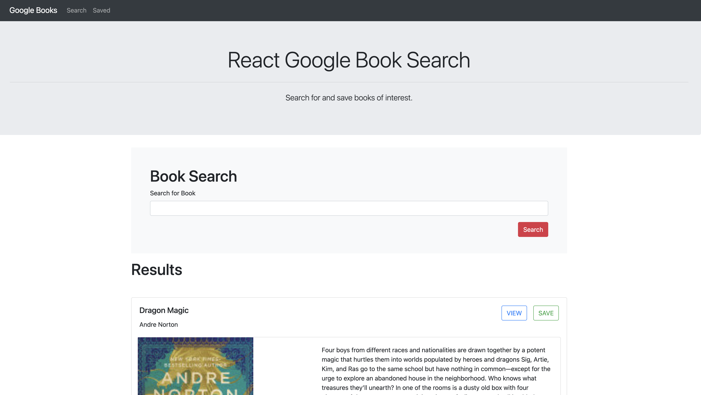

# google-books-react-app

## Description
This is a React-based Google Books Search app. It utilizes React components, helper/util functions, React lifecycle methods to query and display books based on user searches. Node, Express and MongoDB is also used so that users can save books to review or purchase later.

## Table of Contents

* [Installation](#installation)

* [License](#license)

## Installation

This application can be installed here: [GitHub Repository](https://github.com/derrickhardison/google-books-react-app). It can be downloaded via SSH or as a zip file to your local PC. Additionally, the repository can be forked. See image A-1 for additional help. Please be sure to download all files and keep file structure the same in order to ensure images and styling loads as intended. 

The live deployed version can be viewed here: [Heroku Deployed version](https://sleepy-meadow-13628.herokuapp.com/)

## License 

MIT License

Copyright (c) [2020] [Derrick Hardison]

Permission is hereby granted, free of charge, to any person obtaining a copy
of this software and associated documentation files (the "Software"), to deal
in the Software without restriction, including without limitation the rights
to use, copy, modify, merge, publish, distribute, sublicense, and/or sell
copies of the Software, and to permit persons to whom the Software is
furnished to do so, subject to the following conditions:

The above copyright notice and this permission notice shall be included in all
copies or substantial portions of the Software.

THE SOFTWARE IS PROVIDED "AS IS", WITHOUT WARRANTY OF ANY KIND, EXPRESS OR
IMPLIED, INCLUDING BUT NOT LIMITED TO THE WARRANTIES OF MERCHANTABILITY,
FITNESS FOR A PARTICULAR PURPOSE AND NONINFRINGEMENT. IN NO EVENT SHALL THE
AUTHORS OR COPYRIGHT HOLDERS BE LIABLE FOR ANY CLAIM, DAMAGES OR OTHER
LIABILITY, WHETHER IN AN ACTION OF CONTRACT, TORT OR OTHERWISE, ARISING FROM,
OUT OF OR IN CONNECTION WITH THE SOFTWARE OR THE USE OR OTHER DEALINGS IN THE
SOFTWARE.
